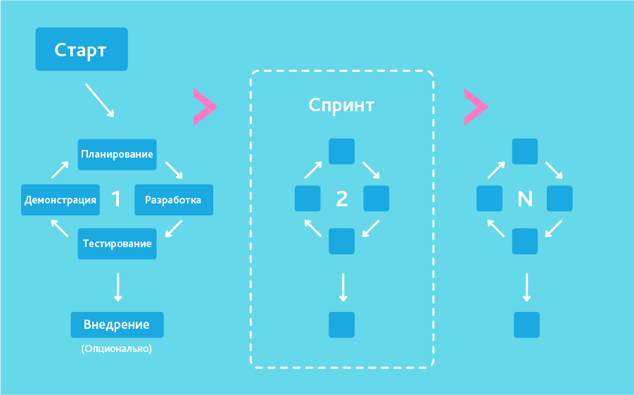

## Обзор нашей команды
Наша команда:
 Алексей: наш техногений, генератор шуток, создатель идеи и просто хороший человек,  
 Тимур:  гуру маркетинга, мастер-составитель диаграмм и рациональный центр нашей команды,   
and me...
### Как мы работаем в команде?
Работаем мы весело и с задором. Генерируем идеи на ходу, черпая их из почти из воздуха.  
Имеет ли это результат? Увидим, когда умный модератор принесёт нам первый миллион.
### Какие методологии разработки ПО мы используем? 
Во-первых, мы используем «Agile Model» (гибкую методологию разработки), чтобы поддерживать с клиентом обратную связь.   

Во-вторых, для разработки программного обеспечения мы применяем «Waterfall Model» (каскадную модель или «водопад»).
(Здесь должны быть картинки.)    

### Почему наша команда настолько крута, что может реализовать вашу идею?
Потому что мы имеем для этого и возможности, и способности, и желание. А что ещё нужно? :)  
## Бизнес-план
Зарабатывать мы будем за счет экономической поддержки владельцев информационных ресурсов, которым мы будем предоставлять помощь в улучшении виртуальной атмосферы.  
Сначала мы планируем продвигать умного модератора в сообществах узкого круга, например, не слишком многочисленных группах ВКонтакте, посредством размещения информации о нас на специализированных бизнес-площадках, а также с помощью рекламы.  Грамотная подача и дружелюбная атмосфера в нашей команде 
## Аудитория проекта и его потребности
Аудиторией нашего проекта можно считать владельцев контент-сообществ, которые нуждаются в поддержании здоровой эмоциональной атмосферы.  Мы верим, что, помогая таким сервисам стать менее токсичными, наша команда сможет сделать Интернет добрее.
